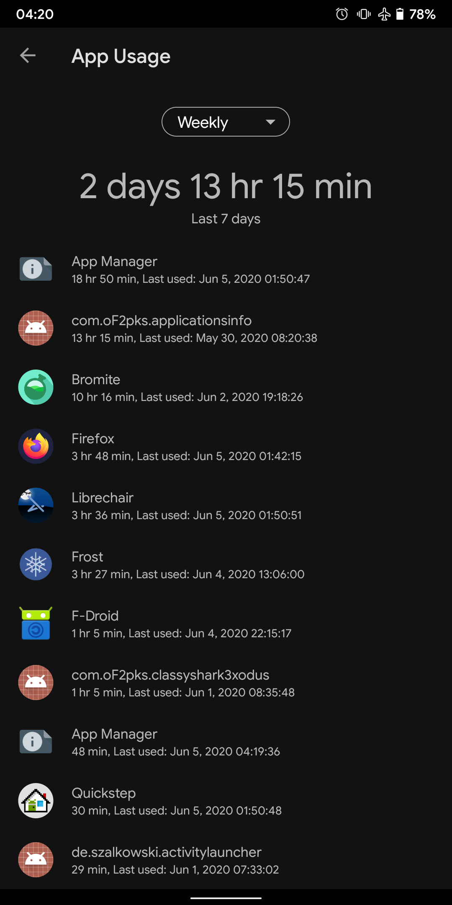
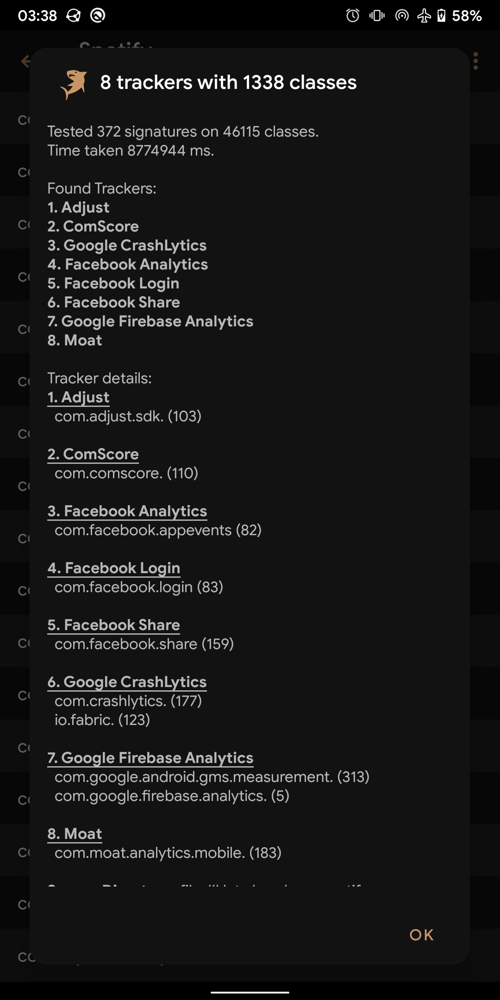
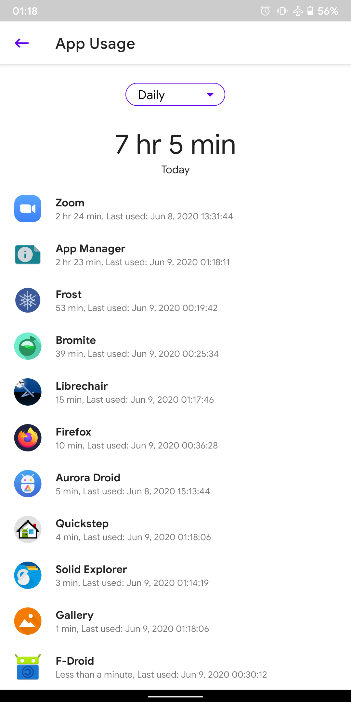

# App Manager

[](https://hosted.weblate.org/engage/app-manager/)
[](https://github.com/MuntashirAkon/AppManager/releases/latest)
[](https://f-droid.org/packages/io.github.muntashirakon.AppManager)

[](https://t.me/AppManagerChannel)


Yet another Android package manager and viewer, but...

- Copylefted libre software (GPLv3+)
- Material design (and a nice UI)
- No unnecessary permissions
- Does not connect to the Internet (the permission is required for ADB mode)
- Displays as much info as possible in the main window
- Lists activities, broadcast receivers, services, providers, permissions, signatures, shared libraries, etc. of any app
- Launch (exportable) activities, create (customizable) shortcuts
- Block any activities, broadcast receivers, services, or providers you like with native import/export as well as Watt and Blocker import support (requires root)
- Revoke permissions considered dangerous (requires root/ADB)
- Disable app ops considered dangerous (requires root/ADB)
- Scan for trackers in apps and list (all or only) tracking classes (and their code dump)
- Generate dynamic manifest for any app
- View/edit/delete shared preferences of any app (requires root)
- Display running processes/apps (requires root/ADB)
- Display your app usage, data usage, and app storage info (requires “Usage Access” permission)
- Share APK files (hence the use of a provider)
- Clear app data or app cache (requires root/ADB)
- Batch operations: clear app data, disable run in background, disable/kill/uninstall apps
- One-click operations: block ads/tracker components, block components by signature, block multiple app ops

…and other minor features such as installing/uninstalling/updating/enabling/disabling apps, displaying app installation info, opening in F-Droid, Aurora Droid or Aurora Store. This single app combines the features of 5 or 6 apps any tech-savvy person needs!

[](https://f-droid.org/packages/io.github.muntashirakon.AppManager)
[](https://apt.izzysoft.de/fdroid/index/apk/io.github.muntashirakon.AppManager)

[App Manager Docs](https://muntashirakon.github.io/AppManager)

### Translations

Help translate [the app strings](https://hosted.weblate.org/engage/app-manager/) and [the docs](https://hosted.weblate.org/projects/app-manager/docs/) at Hosted Weblate.


[](https://hosted.weblate.org/engage/app-manager/)


### Community

There is a [Telegram channel](https://t.me/AppManagerChannel) for App Manager.

### Mirrors

**[GitLab](https://gitlab.com/muntashir/AppManager)** - **[Riseup](https://0xacab.org/muntashir/AppManager)** - **[Codeberg](https://codeberg.org/muntashir/AppManager)**

### Screenshots

#### Dark



#### Light



### Build Instructions
* **System Requirements:** Any computer with 4GB RAM (8GB recommended)
* **Operating System:** Linux/macOS (no support for Windows)
* **Software:** Android Studio, Gradle
* Active internet connection

#### macOS
- Install Homebrew:
  ```bash
  /bin/bash -c "$(curl -fsSL https://raw.githubusercontent.com/Homebrew/install/HEAD/install.sh)"
  ```
- Install `yarn` using Homebrew:
  ```bash
  brew install yarn
  ```
  You can also install `yarn` manually, but it is not recommended for macOS.
- Install `bundletool` if you want to build APKS:
  ```bash
  brew install bundletool
  ```

#### Linux|GNU
- Install the development tools.
  For Debian/Ubuntu:
  ```bash
  sudo apt-get install build-essential
  ```
  For Fedora/CentOS/RHEL:
  ```bash
  sudo yum groupinstall "Development Tools"
  ```
  For Arch/Artix/Manjaro:
  ```bash
  sudo pacman -S base-devel
  ```
- Install `yarn`. A generic way would be to install it via the installation script:
  ```bash
  curl -o- -L https://yarnpkg.com/install.sh | bash
  ```
- Install [**bundletool-all.jar**](https://github.com/google/bundletool) if you want to build APKS, and make sure it is available as `bundletool` command. A quick way would be to create a file `bundletool` in `/usr/local/bin` directory with the following content:
  ```bash
  #!/usr/bin/env bash
  exec java -jar "/path/to/bundletool-all.jar" "$@"
  ```
  Make sure to replace `/path/to/bundletool-all.jar` with the actual path for **bundletool-all.jar**. Also, make the file executable:
  ```bash
  chmod +x /usr/local/bin/bundletool
  ```

#### Clone and Build App Manager
1. Clone the repo along with submodules:
    ```bash
    git clone --recurse-submodules https://github.com/MuntashirAkon/AppManager.git
    ```
    You can use the `--depth 1` argument if you don't want to clone past commits.
2. Open the project **AppManager** using Android Studio/IntelliJ IDEA. The IDE should start syncing automatically. It will also download all the necessary dependencies automatically provided you have the Internet connection.
3. Build debug version of App Manager from _Menu_ > _Build_ > _Make Project_, or, from the terminal:
    ```
    ./gradlew packageDebugUniversalApk
    ```
   The command will generate a universal APK instead of a bundled app.

#### Create bundled app
In order to create a bundled app in APKS format, build Android App Bundle (AAB) first. Then run the following command:
```bash
./scripts/aab_to_apks.sh preRelease
```
Replace `prePelease` with `release` or `debug` based on your requirements. It will ask for keystore credentials interactively.

The script above will also generate a universal APK.

### Contributing
You are welcome contribute to App Manager! This doesn't mean that you need coding skills. You can help App Manager by creating helpful issues, attending discussions, improving documentations and translations, making icon for icon packs, adding unrecognised libraries or ad/tracking signatures, reviewing the source code, as well as reporting security vulnerabilities. If you are going to contribute to AM with your coding skills, please read the following:
- If you're going to implement or work on any specific feature, please inform me before doing so. Due to the complex nature of the project, integrating a new feature could be challenging.
- You're absolutely welcome to fix issues or mistakes, but App Manager's code base changes a lot almost every day. Therefore, if you are requested to make changes in your pull request but can't address them within 2 (two) days, your pull request may be closed depending on the importance of the request. This instruction will be removed once the code base is stable.

**Note:** Repositories located in sites other than GitHub are currently considered mirrors and PR/MR submitted there will not be accepted. Instead, you can submit patches (as `.patch` files) via email attachment. My email address is muntashirakon [at] riseup [dot] net. Beware that such emails may be publicly accessible in future. GitHub PRs will be merged manually using the corresponding patches. As a result, GitHub may falsely mark them _closed_ instead of _merged_. Make sure to sign-off your commits.

### Donation and Funding
**App Manager doesn't support any donations directly.** However, if you like my projects (App Manager being one of them), you can buy me a coffee by sending an anonymous donation to one of the following **Bitcoin** addresses:
```
33TDkWVv5EgwfKGJk7YaS2Ev1CBzBP9Sav
38bzvWDD99dJhXg9tC4yQEnGdnAKPtwSXG
3FHTxPoYa92dNJK6pkhwyVkMG8Vv3VpGpg
```
By sending me BTC, you agree that you will not share the transaction info in public i.e. the transaction will remain anonymous, nor will you use it as a leverage to prioritise your requested features. I accept feature requests without any donations, and they are prioritised according to my preferences.

**App Manager is open for funding/grants.** If you are an organisation interested in funding it you can contact me directly at muntashirakon [at] riseup [dot] net (FINGERPRINT: `7bad37c2981e41f8f6abea7f58f0b4f26c346fce`).

### Credits and Libraries
A list of credits and libraries are available in the **About** section of the app.
