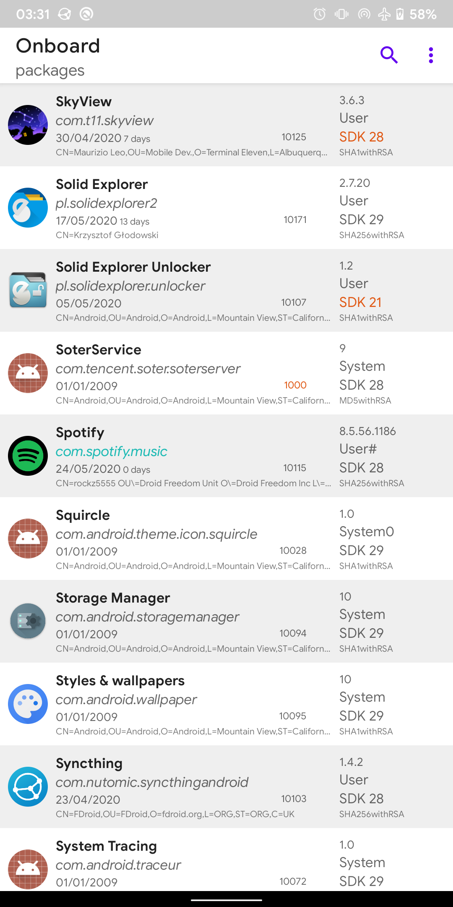
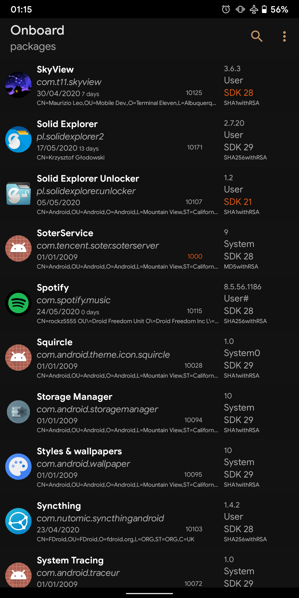
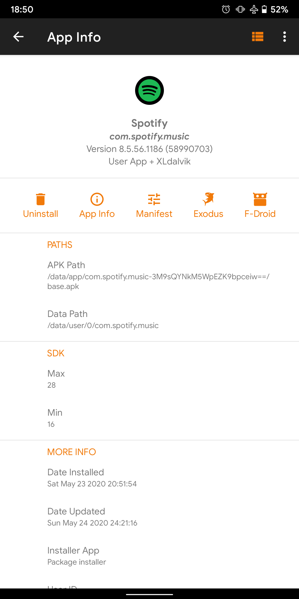
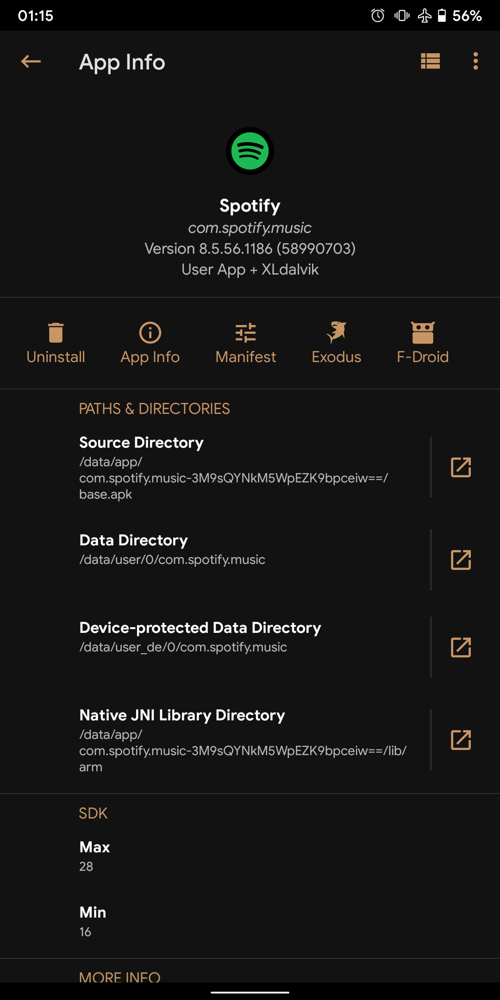
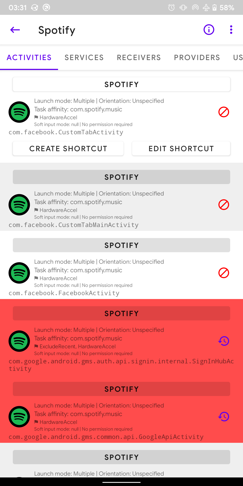
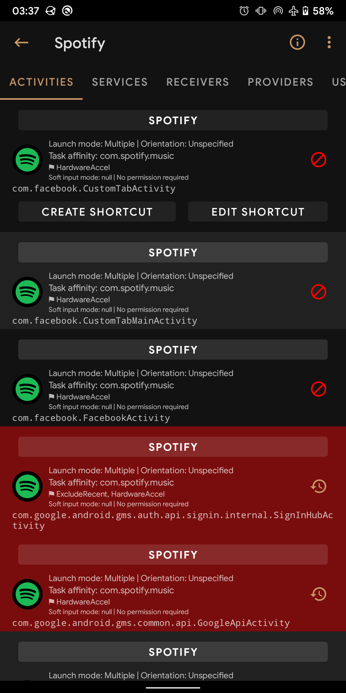
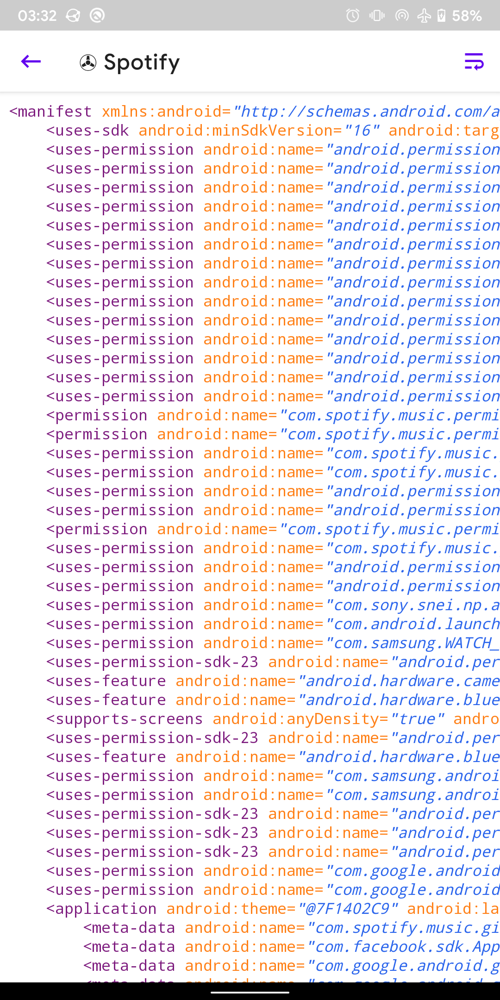
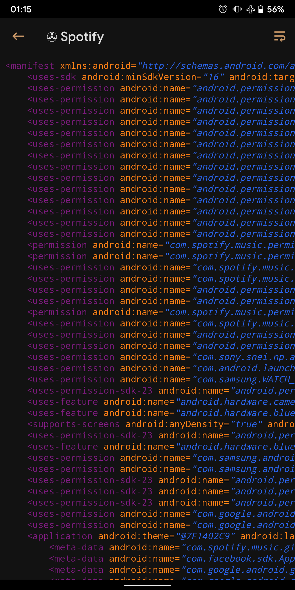
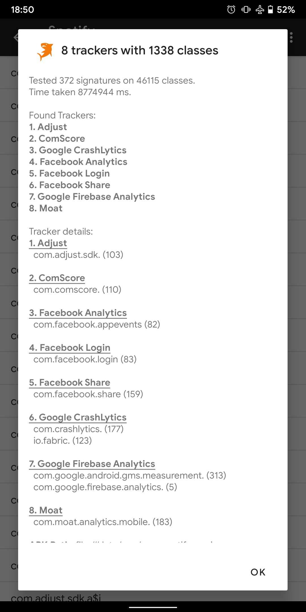

<!-- SPDX-License-Identifier: GPL-3.0-or-later OR CC-BY-SA-4.0 -->

  

<h1 align="center">App Manager</h1>

  <a href="https://muntashirakon.github.io/AppManager">Docs</a> ·
  <a href="https://github.com/MuntashirAkon/AppManager/releases">Releases</a> ·
  <a href="https://t.me/AppManagerChannel">Telegram Channel</a>

---

## Features

### General features
- Fully reproducible, copylefted libre software (GPLv3+)
- Material 3 with dynamic colours
- Displays as much information as possible in the main page
- Lists activities, broadcast receivers, services, providers, app ops, permissions, signatures, shared libraries, etc.
  of an application
- Launch activities and services
- Create shortcuts of activities
- [Intercept activities](https://muntashirakon.github.io/AppManager/#sec:interceptor-page)
- Scan for trackers and libraries in apps and list (all or only) tracking classes (and their code dump)
- View/save the manifest of an app
- Display app usage, data usage (mobile and Wi-Fi), and app storage info (requires “Usage Access” permission)
- Install/uninstall APK files (including APKS, APKM and XAPK with OBB files)
- Share APK files
- Back up/restore APK files
- Batch operations
- Single-click operations
- Logcat viewer, manager and exporter
- [Profiles](https://muntashirakon.github.io/AppManager/#sec:profiles-page) (including presets for quick debloating)
- Open an app in Aurora Store or in your favourite F-Droid client directly from App Manager
- Sign APK files with custom signatures before installing
- Backup encryption: OpenPGP via OpenKeychain, RSA, ECC (hybrid encryption with AES) and AES.
- Track foreground UI components

### Root/ADB-only features

- Revoke runtime (AKA dangerous) and development permissions
- Change the mode of an app op
- Display/kill/force-stop running apps or processes
- Clear app data or app cache
- View/change net policy
- Control battery optimization

### Root-only features

- Block any activities, broadcast receivers, services, or providers of an app with native import/export as well as Watt
  and Blocker import support
- View/edit/delete shared preferences of any app
- Back up/restore apps with data, rules and extras (such as permissions, battery optimization, SSAID, etc.)
- View system configurations including blacklisted or whitelisted apps, permissions, etc.
- View/change SSAID

…and many more! This single app combines the features of 5 or 6 apps any tech-savvy person needs!

### Upcoming features
- APK editing
- Code editor
- Routine operations
- Finder: Find app components, permissions etc. in all apps
- Enable/disable app actions such as launch on boot
- Panic responder for Ripple
- Crash monitor
- Systemless disabling/uninstalling of the system apps
- Import app list exported by App Manager
- More advance terminal emulator
- File manager
- Database viewer and editor, etc.

## Translations

Help translate [the app strings](https://hosted.weblate.org/engage/app-manager/) and
[the docs](https://hosted.weblate.org/projects/app-manager/docs/) at Hosted Weblate.

## Mirrors

[GitLab](https://gitlab.com/muntashir/AppManager) · [Riseup](https://0xacab.org/muntashir/AppManager) ·
[Codeberg](https://codeberg.org/muntashir/AppManager)

## Screenshots

## Build Instructions
See [BUILDING.rst](BUILDING.rst)

## Contributing

See [CONTRIBUTING.rst](CONTRIBUTING.rst)

## Donation and Funding

_Donation or purchasing is not a requirement in order to use app Manager._ While App Manager does not support any
purchases, donations can be sent to the owner of App Manager through Open Source Collective.

Open Source Collective is a fiscal host in the Open Collective platform which helps the open source projects manage
their finances. At present, it supports payments through bank accounts, PayPal, credit or debit cards and
cryptocurrencies.

Link: https://opencollective.com/muntashir

By sending donations, the senders agree that they shall not use the donations as a leverage to prioritise their
requested features. Feature requests do not require any bounties or donations, and they are prioritised in accordance
with the preferences of the owner.

**App Manager accepts any offers of funding/grants.** Representatives of the interested organization can contact the
owner directly at muntashirakon [at] riseup [dot] net (FINGERPRINT: `7bad37c2981e41f8f6abea7f58f0b4f26c346fce`).

## Credits and Libraries

A list of credits and libraries are available in the **About** section of the app.
