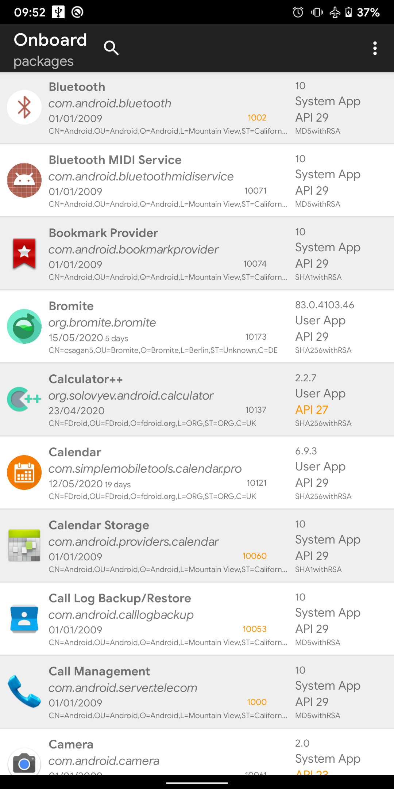
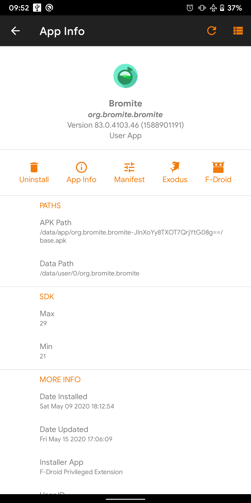
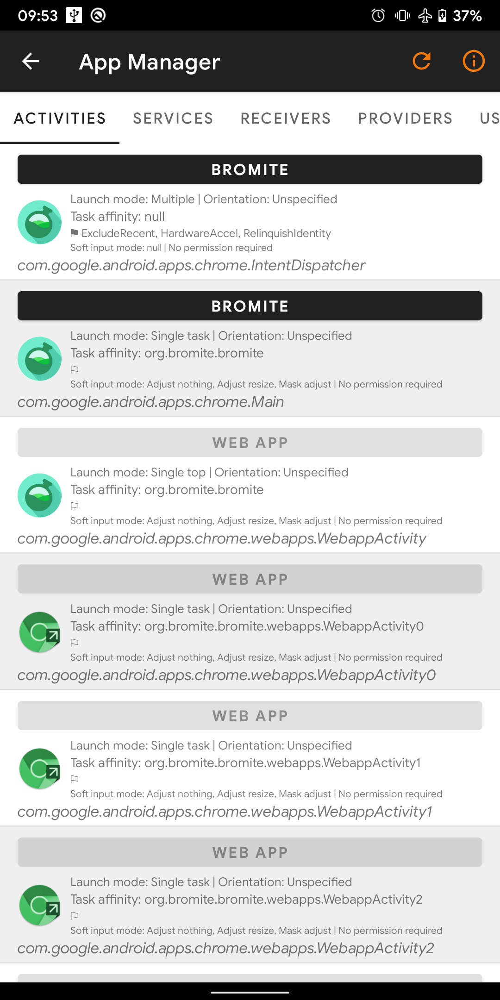
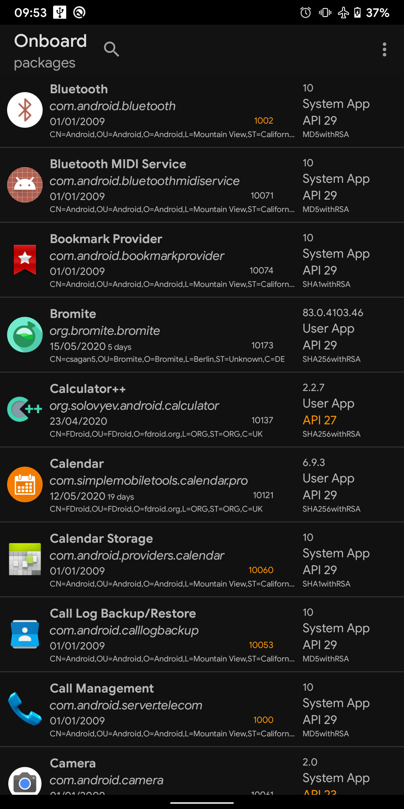
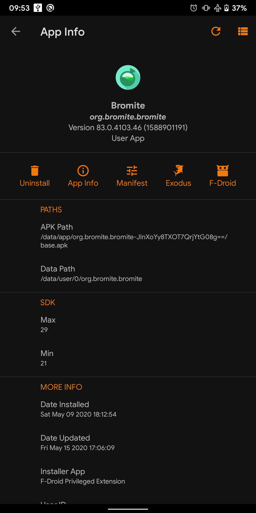
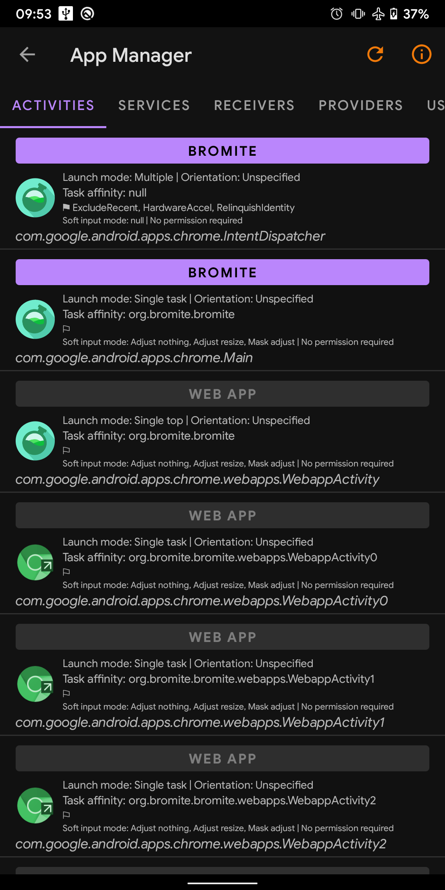

# App Manager

Yet another android package manager and viewer.

I started by forking [Apps_packages Info](https://bitbucket.org/oF2pks/fdroid-applications-info/src). But more or less the entire project has been rebuilt.

I've plan to merge this project with other app managers such as Watt, Activity Launcher and ClassyShark3xodus (it's really a pain to keep four apps installed!).

### Status

- [x] [Apps_packages Info](https://bitbucket.org/oF2pks/fdroid-applications-info/src)
- [x] [Activity Launcher](https://github.com/butzist/ActivityLauncher)
- [ ] Watt
- [ ] ClassyShark3xodus

### Screenshots

#### Light

### License

I've changed the license from Apache 2.0 to GPLv3.0 for obvious reasons.
